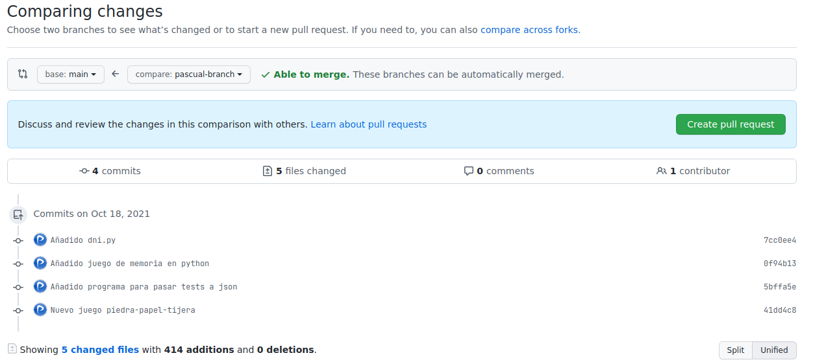

# Tarea 5. Shared repository. Trabajando con Ramas

## Vídeo

[Enlace al vídeo](https://youtu.be/83IuqFAIWPg)

## Repositorio en el que hemos trabajado

[Enlace al repositorio](https://github.com/cifpfbmoll/hello-world-group)

## Pascual Barrer Ferrer

En esta tarea vamos a trabajar en equipo. Uno de nosotros ha creado el repositorio en GitHub y nos ha invitado como colaboradores para que podamos contribuir en él.

Lo primero que debemos hacer es clonar el repositorio en una carpeta de nuestro ordenador para poder trabajar en local. Para hacerlo basta con hacer `git clone <dirección del repositorio>`.

Una vez finalizada la clonación, nos movemos a la carpeta recién creada por `git` en donde se encuentran todos los cambios (si hubiera) realizados hasta ahora en el repositorio remoto.

Para poder trabajar sin afectar al resto de compañeros es muy importante hacerlo desde nuestra propia rama. Allí podremos realizar todos los cambios que deseemos sin tocar para nada la rama `main`. Para crearnos una rama nueva lo hacemos mediante `git branch <nombre de la rama>` y nos posicionamos dentro mediante un `git checkout <nombre de la rama>`.

Una vez localizados en nuestra nueva rama empezamos a realizar los cambios que creamos oportunos. En nuestro caso, añadimos diversos programas en Python que tenemos en el ordenador. Para guardar los cambios en `git`, como siempre, hacemos un `add` y, luego, un `commit`.

Repetimos el proceso para añadir más cambios.

Al haber acabado nuestro trabajo podemos hacer un `push` a nuestra rama en remoto para, así, no tocar la rama `main`.

Si nos dirigimos a GitHub, donde se encuentra nuestro repositorio remoto, vemos que la rama que teníamos en local ahora se encuentra en remoto también.

Si nos movemos a la pestaña de *Pull requests* nos aparecerá un botón para crear un *New pull request*. Si le clicamos...

... nos aparece una nueva ventana donde nos da la opción de comparar dos ramas. Nosotros elegiremos como base la `main` y la compararemos con la nuestra (`pascual-branch`).

Una vez hecho esto GitHub se encarga de mirar si ambas ramas se pueden unir o si, por el contrario, existen conflictos entre ellas. Como vemos justo al lado de los desplegables para seleccionar ramas, nos ha aparecido un *check* en verde junto al texto *Able to merge* lo que significa que ambas ramas se pueden fusionar sin ningún problema. Pulsamos el botón verde *Create pull request* para crearlo y, así, el mantenedor del código eche un vistazo para saber si incluye los cambios en producción o, por el contrario, los rechaza o pide que se hagan algunos cambios.

En la siguiente pantalla que nos sale, nos da la opción (muy recomendable) de añadir un comentario para explicar qué hemos cambiado, por qué, etc. Cuando hemos acabado clicamos en *Create pull request* y listo.

Ahora nuestros cambios están incluidos en un *pull request* para que el encargado de revisar los cambios les dé el visto bueno o pida algunos cambios para mejorarlos.

Cuando el revisor acepta los cambios aparece un aviso y, si vamos a nuestro *pull request* vemos el estado en que se encuentra (en este caso, aprobado) y quién ha sido el revisor. También vemos que el revisor ha fusionado nuestra rama con `main` y que, además, al no hacer falta ya, la ha borrado.

Vayamos ahora a mirar qué *pull requests* (PR) tenemos para revisar. Para ello nos dirigimos a la pestaña homónima y observamos que hay dos PR todavía abiertos. Elegimos uno, por ejemplo, el de *Sandra branch*.

En él vemos que contiene cinco *commits* con su respectivo mensaje que nos aclara qué aportan al proyecto. Un aspecto importante a destacar de esta pantalla es que nos informa de si la fusión de la rama con `main` se puede realizar limpiamente (sin conflictos que resolver). Si clicamos en la pestaña de *Files changed* podremos ver qué archivos han cambiado, tanto modificaciones como creaciones o deleciones.

En la pestaña de archivos modificados vemos todos los archivos que se han cambiado, las líneas añadidas y las eliminadas. Así, el revisor tiene una visión de todo lo que se ha hecho y puede decidir qué hacer con el *pull request*.

En este caso como que todos los cambios son acertados y no presentan ningún conflicto con el código que ya estaba presente en la rama `main`, se decide aceptar el PR. Para ello, se da clic en el botón verde *Merge pull request* que salía en la pestaña *Conversation* que hemos visto anteriormente. Se nos pedirá una confirmación de seguridad y clicamos en *Confirm merge*.

Una vez confirmado nos informa de que la rama de trabajo se puede borrar ya que está a la par con la `main` y lo hacemos.

La siguiente notificación nos informa de que hemos borrado la rama.

Ahora los cambios introducidos en la rama recién borrada ya se encuentran en producción.
